# SHEMS - UI

SHEMS - Short for **_Smart Home Energy Management System_**

This is a [Next.js](https://nextjs.org) project bootstrapped with [`create-next-app`](https://nextjs.org/docs/app/api-reference/cli/create-next-app).

## My environment

npm: 10.9.2
node: 22.13.0
Next.js: 15.1.4

## Build and run

Please use `npm install --legacy-peer-deps` to install deps.

```bash
npm run build
npm run start
# or
npm run dev
```

## It's time to see the result

Open [http://localhost:3000](http://localhost:3000) with your browser to see the result.

You can find admin's username, admin's password and user's password in [./src/constants/constants.ts](./src/constants/constants.ts)

## Screenshots

### **_For both user and admin_**

#### Login

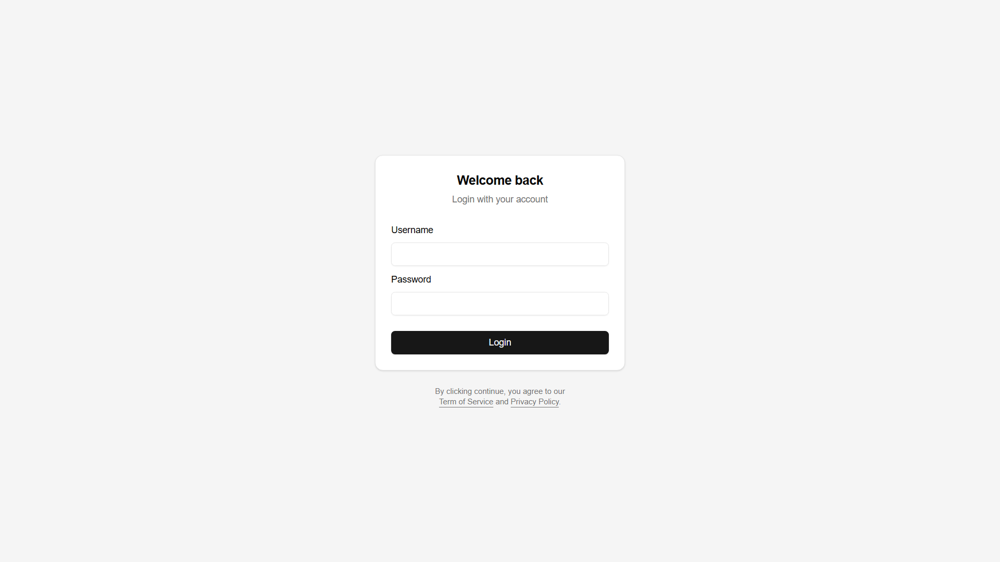

#### Login dialog

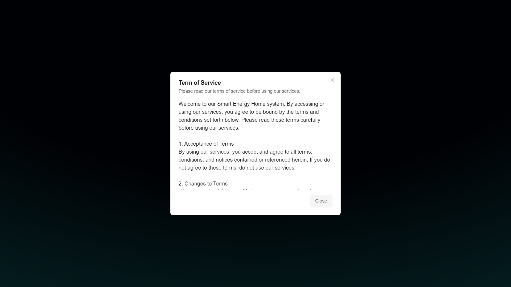

---

### **_For user_**

#### Dashboard

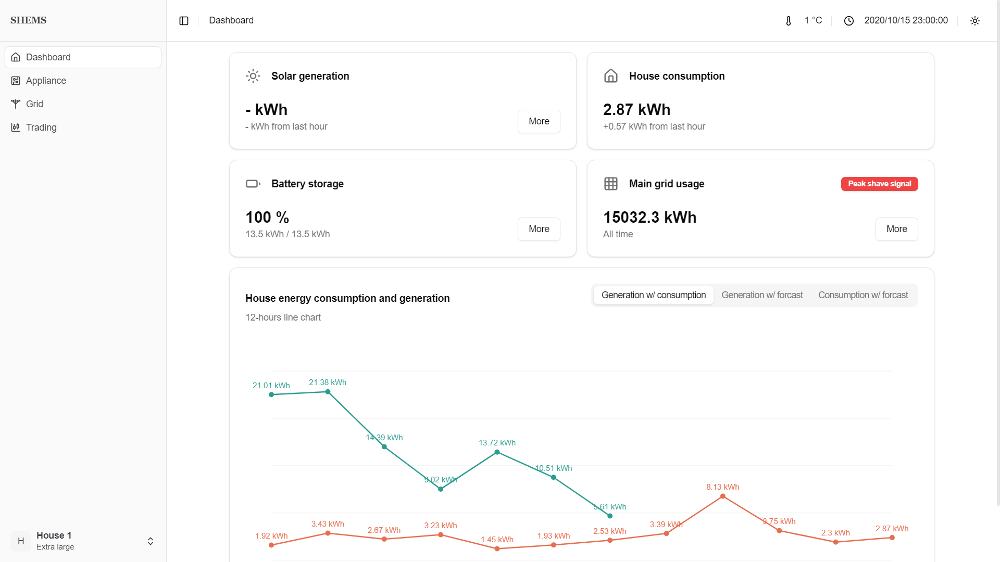

#### Dashboard solar drawer

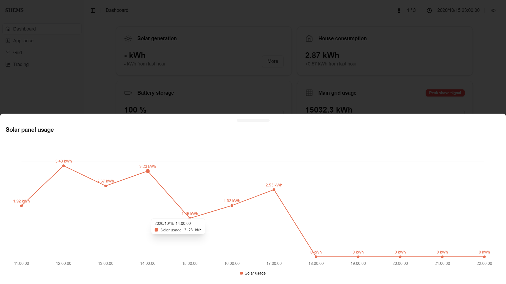

#### Dashboard battery drawer

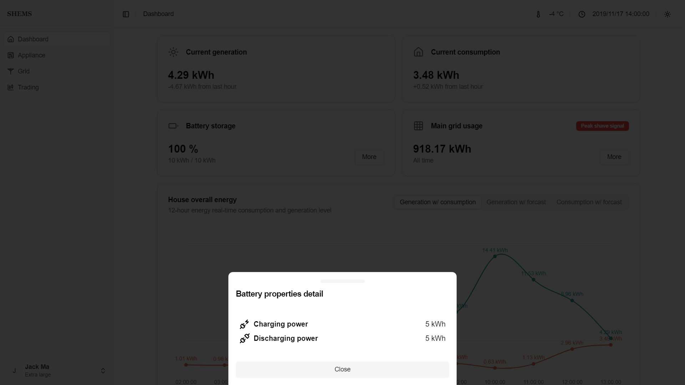

#### Dashboard grid drawer

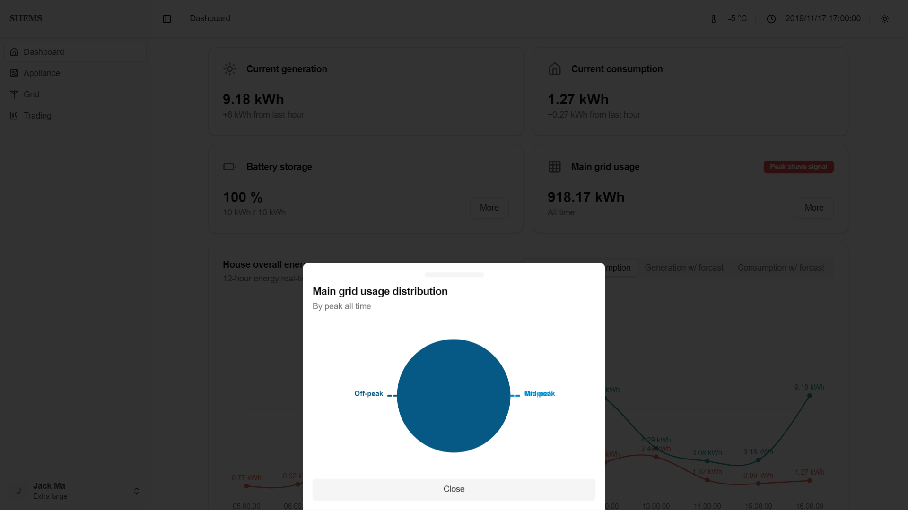

#### Appliance

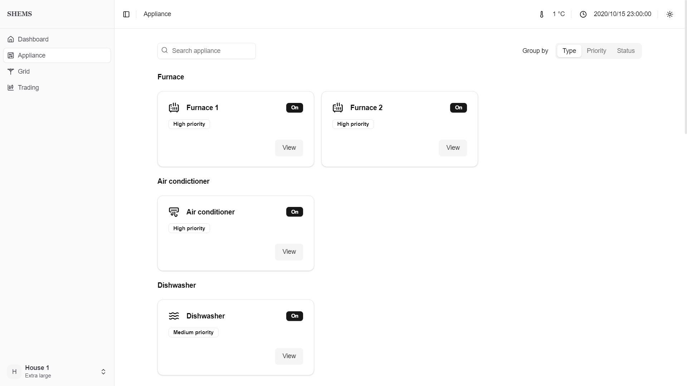

#### Appliance detail

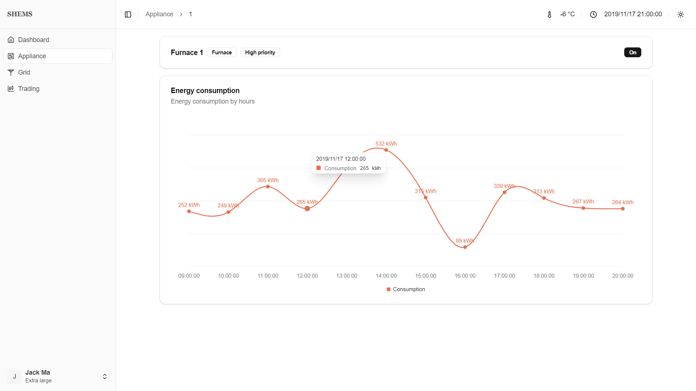

#### Grid

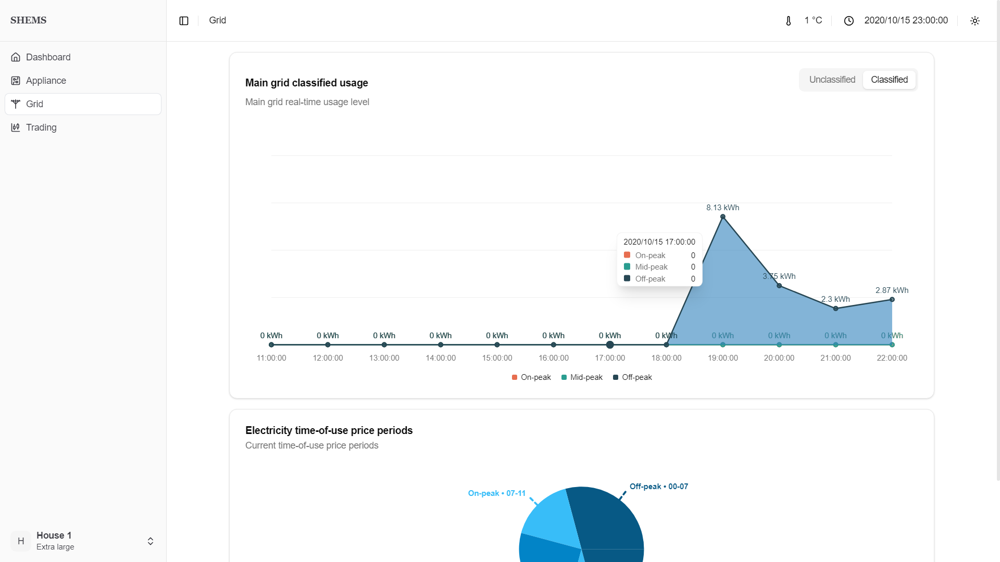

#### Trading


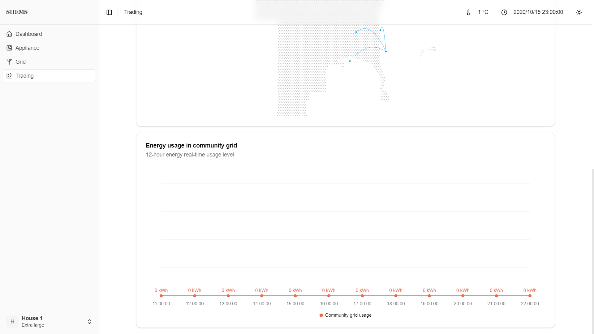

---

### **_For admin_**

#### Dashboard

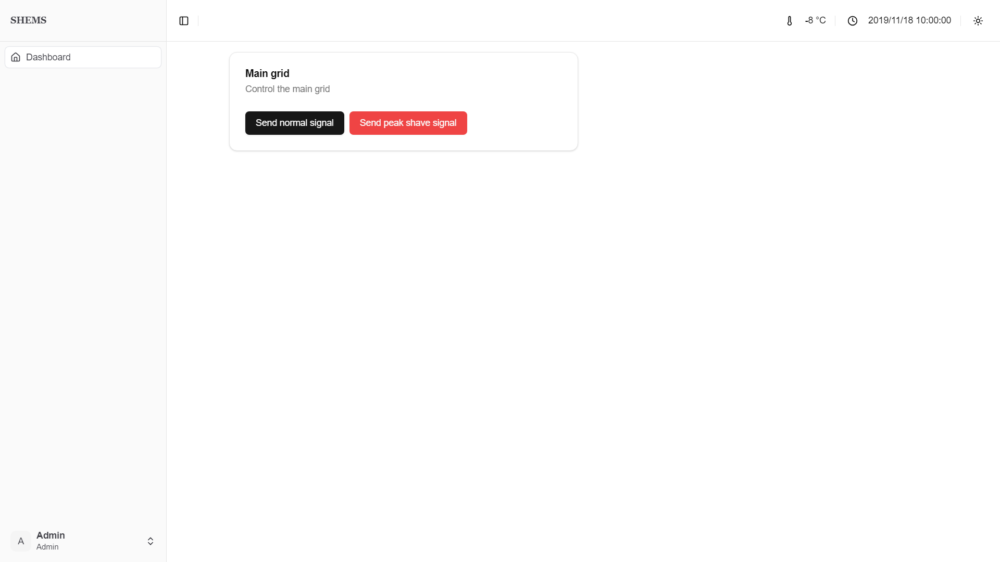
